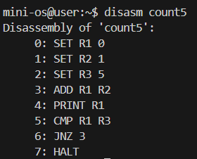
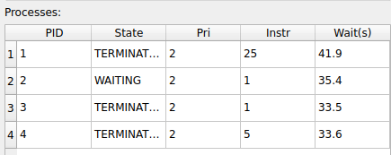
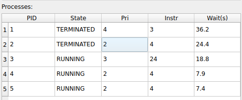
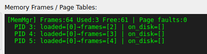

# Python-Mini-OS：小型作業系統虛擬化模擬器

這是一個基於 Python 開發的教育用作業系統模擬器。它完整模擬了現代作業系統的核心功能，包含虛擬機執行、分頁記憶體管理、行程排程、行程間通訊（IPC）以及同步機制。

本專案提供兩種操作模式：
1.  **終端機互動模式 (`main.py`)**：適用於 Windows 原生環境，提供強大的指令列 Shell。
[詳細指令網頁説明]()
2.  **視覺化圖形儀表板 (`gui_main.py`)**：運行於 WSL 環境，即時監控系統資源與行程狀態。

---

## 核心功能描述

### 1. 虛擬機運算核心 (VM Hardware Simulation)
*   **技術細節**：模擬一個 8-bit 風格的 CPU 運算單元。包含四個通用暫存器 (**R1-R4**)、一個程式計數器 (**PC**)、一個指令暫存器 (**IR**) 以及狀態旗標 (**ZF, SF**)。
*   **運作機制**：採用 **Fetch-Decode-Execute** 週期。每執行一條指令，VM 會檢查記憶體存取權限，若 PC 指向的位址不在實體記憶體中，會自動觸發硬體層級的 **Page Fault 異常** 回傳給 OS 處理。



### 2. 五狀態行程管理 (Process Life-cycle)
*   **技術細節**：實現了典型的作業系統行程狀態圖：
    *   **NEW**：行程剛被創建，等待分配記憶體。
    *   **READY**：已載入記憶體，等待排程器分配 CPU 時間。
    *   **RUNNING**：正在虛擬機上執行指令。
    *   **WAITING**：因執行 `RECV` 或 `WAIT` 而進入阻塞狀態，放棄 CPU 權限。
    *   **TERMINATED**：執行完成，回收所有資源（記憶體與信箱）。
*   **內文切換 (Context Switch)**：當時間片用完時，系統會將 R1-R4, PC, Flags 存入行程控制塊 (PCB)，確保下次執行能完美銜接。



### 3. 動態排程與老化機制 (Dynamic Scheduling & Aging)
*   **技術細節**：支援四種算法：
    *   **FIFO**：公平排隊。
    *   **Round Robin (RR)**：固定時間片切換，確保每個行程都有進度。
    *   **Priority**：高權限優先。
    *   **SJF**：預測最短任務優先。
*   **老化解決方案**：為了解決高優先級任務導致的「行程飢餓 (Starvation)」，系統會監控行程在 Ready 隊列的停留時間，**自動增加**其優先權級。



### 4. 分頁記憶體與置換算法 (Paging & Swapping)
*   **技術細節**：將虛擬記憶體切分為 **16-byte** 的頁面 (Page)。系統採用 **Demand Paging (請求分頁)** 策略：程式啟動時僅載入第一頁，其餘頁面存於虛擬磁碟中，只有在發生 **Page Fault** 時才會調入實體框 (Frame)。
*   **置換機制**：當 64 個實體框全滿時，系統會啟動置換算法（類似 LRU/FIFO 混合），將最不常用的頁面移出記憶體並寫回磁碟。



### 5. 同步機制與死結防護 (Synchronization & Deadlock)
*   **技術細節**：
    *   **Semaphore**：透過底層 `WAIT/SIGNAL` 指令實現互斥鎖。如果一個行程嘗試 `WAIT` 一個已被佔用的號誌，它會被立即加入該號誌的等待隊列並阻塞。
    *   **死結偵測**：系統後台有一個守護進程，週期性建構 **資源等待圖 (Resource Wait-for Graph)**。若圖中出現「環狀等待」，系統會即時在 Log 警示。

---

## 使用教學

### 模式一：終端機互動模式 (Windows 原生)
此模式最為輕量，適合進行指令操作與腳本測試。

1.  開啟 **PowerShell** 或 **CMD**。
2.  進入專案目錄。
3.  執行指令：
    ```powershell
    python main.py
    ```
4.  **常用指令**：
    *   `ls`：查看內建程式。
    *   `run <prog> [priority]`：載入行程。
    *   `start [quantum]`：啟動排程器。
    *   `top`：查看行程即時清單。
    *   `tui`：在終端機內開啟簡易圖形監控（Curses 版）。

---

### 模式二：圖形化儀表板 (WSL + 虛擬環境)
此模式適合觀察記憶體分配、行程切換及號誌狀態。

1.  開啟 **WSL (Ubuntu)**。
2.  進入專案目錄：

    ```bash

    cd /mnt/c/Users/dongh/Desktop/大二下系統程式/homework/_sp/虛擬機2

    ```
3.  啟用虛擬環境並安裝PyQt6：

    ```bash

    sudo apt update
    sudo apt install python3-venv python3-pip -y
    python3 -m venv minios_wsl
    source minios_wsl/bin/activate
    pip install PyQt6

    ```

4.  執行圖形介面程式：

    ```bash

    python3 gui_main.py

    ```
5.  **操作說明**：
    *   使用下拉選單選擇程式並點擊 **Load Process**。
    *   點擊 **Start Scheduler** 啟動 CPU。
    *   觀察右側的 **System Logs** 以查看虛擬機輸出，並透過左側表格監控行程進度。

---

## 虛擬機組合語言 (ISA) 範例

系統內建多種測試程式，例如 `factorial` (階乘計算)、`ipc_sender` (通訊測試)、`mutex_demo` (互斥鎖)。

```nasm
; 範例：計數到 5 的程式
SET R1 0     ; R1 = 0
SET R2 1     ; R2 = 1 (增量)
SET R3 5     ; R3 = 5 (目標)
ADD R1 R2    ; R1 = R1 + R2
PRINT R1     ; 輸出當前計數
CMP R1 R3    ; 比較 R1 與 R3
JNZ 3        ; 若不等於則跳回第 3 行
HALT         ; 結束
```

---

## 檔案架構
*   `main.py`: 系統進入點 (Shell)。
*   `gui_main.py`: 圖形介面進入點 (PyQt6)。
*   `os_kernel.py`: 作業系統核心邏輯（行程切換、中斷處理）。
*   `vm.py`: 虛擬機硬體模擬（CPU 指令執行）。
*   `memory.py`: 分頁記憶體管理器。
*   `scheduler.py`: 各類排程演算法實現。
*   `semaphore.py`: 號誌與互斥鎖管理。
*   `ipc.py`: 行程間訊息傳遞系統。
*   `deadlock.py`: 死結偵測演算法。
*   `assembler.py`: 將 .asm 原始碼編譯為機器碼。
*   `tui.py`: 基於終端機的 curses 圖形化界面。
*   `io_utils.py`: 處理跨執行緒的安全輸出與輸入。