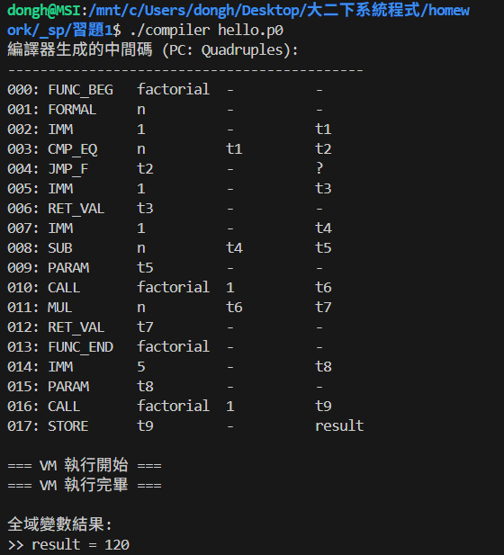

# P0 語言編譯器與虛擬機 (P0 Compiler & VM)

這是一個用 C 語言實作的微型編譯器系統。它能夠將類 C 語法的 **p0 語言** 原始碼，編譯成中間碼（四元組，Quadruples），並在自製的虛擬機 (Virtual Machine) 上執行。

## 與 AI 的對話記錄

[Google AI Studio 對話連結](https://aistudio.google.com/app/prompts?state=%7B%22ids%22:%5B%221chDpbNUfRiMtLmSJMenMdjvk-iIIkVxJ%22%5D,%22action%22:%22open%22,%22userId%22:%22104108532823114063447%22,%22resourceKeys%22:%7B%7D%7D&usp=sharing,)

## 核心功能

- **完整編譯流程**：包含詞法分析 (Lexer)、語法解析 (Parser) 與中間碼生成。
- **支援算術運算**：支援 `+`, `-`, `*`, `/` 以及括號優先級處理。
- **流程控制**：支援 `if` 條件判斷與 `while` 迴圈（具備回填 Backpatching 技術）。
- **函數系統**：
    - 支援函數定義 (`func`) 與回傳值 (`return`)。
    - 支援**遞迴呼叫**（透過 Stack Frame 管理作用域）。
- **虛擬機 (VM)**：模擬 CPU 暫存器與記憶體堆疊，直接執行生成的四元組指令。

---

## p0 語法定義 (EBNF)

- *EBNF (Extended Backus-Naur Form)*：是電腦科學中用來精確描述一種「程式語言規則」的符號。

    `=`：定義為...

    `|`：或者 (OR)

    `{ }`：出現 0 次或多次（重複）

    `[ ]`：選用（出現 0 次或 1 次）

    `" "`：字面上的字串（必須完全一樣出現）
    

```ebnf
program       = { function_def | statement } ;
function_def  = "func" identifier "(" [ parameter_list ] ")" "{" { statement } "}" ;
statement     = if_statement | while_statement | assignment | return_statement ;
if_statement  = "if" "(" expression ")" "{" { statement } "}" ;
while_statement = "while" "(" expression ")" "{" { statement } "}" ;
expression    = arith_expr [ ( "==" | "<" | ">" ) arith_expr ] ;
factor        = number | identifier [ "(" [ args ] ")" ] | "(" expression ")" ;
```

---

## 執行環境需求

- 一個 C 語言編譯器（如 `gcc`, `clang` 或 `MSVC`）。
- 若在 Windows 上，建議使用 `MinGW` 或 `WSL`；macOS/Linux 則直接使用內建終端機。

---

## 執行步驟

### 1. 編譯編譯器本身
在終端機（Terminal）中輸入以下指令：
```bash
gcc compiler.c -o compiler
```
執行後，產生執行檔`compiler.exe`（若在wsl環境下執行，執行檔檔名為`compiler`。

### 2. 執行程式
你可以透過以下兩種方式執行：

#### A. 執行內建測試範例（預設 while 測試）
如果你不提供任何參數，程式會執行 `main` 函數中預設的 `i = 0; while (i < 5) { i = i + 1; }` 程式碼：
```bash
# Windows
./compiler.exe

# macOS / Linux
./compiler
```

#### B. 執行自定義的 p0 檔案
先建立一個檔案 `hello.p0`，內容如下：
```c
func factorial(n) {
    if (n == 1) { return 1; }
    return n * factorial(n - 1);
}

result = factorial(5);
```
然後執行：
```bash
./compiler hello.p0
```

---

## 輸出說明(hello.p0)

執行`hello.p0`後，程式會輸出以下資訊：




### 第一部分：函數入口與參數綁定
這部分處理函數被呼叫時的「開場」。

*   **000: `FUNC_BEG factorial`**
    *   **意義**：標記 `factorial` 函數的起始位置。
    *   **作用**：告訴虛擬機，如果有人呼叫這個名字，請跳轉到這裡開始執行。
*   **001: `FORMAL n`**
    *   **意義**：形式參數 (Formal Parameter) 綁定。
    *   **作用**：從進入函數時帶進來的參數堆疊中取出值，並將其命名為區域變數 `n`。

---

### 第二部分：函數本體 (遞迴與判斷)
這部分對應 `if (n == 1) { return 1; } else { return n * factorial(n-1); }`。

*   **002: `IMM 1 t1`**
    *   **意義**：載入立即值 (Immediate)。將數字 `1` 放入臨時變數 `t1`。
*   **003: `CMP_EQ n t1 t2`**
    *   **意義**：比較是否相等 (Compare Equal)。檢查 `n` 是否等於 `t1` (即 1)。
    *   **結果**：如果相等，`t2` 為 1（真）；否則為 0（假）。
*   **004: `JMP_F t2 - ?`**
    *   **意義**：條件跳轉 (Jump if False)。如果 `t2` 為假（即 n 不等於 1），跳轉到指定的行號。
    *   **注**：執行時，這個 `?` 會被指向第 **007** 行（進入 else 區塊）。
*   **005: `IMM 1 t3`**
    *   **意義**：(這是 If 成立的情況) 載入數字 `1` 到 `t3`。
*   **006: `RET_VAL t3`**
    *   **意義**：回傳值 (Return Value)。結束函數，並將 `t3` (值為 1) 傳回給呼叫者。
*   **007: `IMM 1 t4`**
    *   **意義**：(這是 If 不成立的情況) 載入數字 `1` 到 `t4`，準備做減法。
*   **008: `SUB n t4 t5`**
    *   **意義**：減法運算。計算 `n - 1`，結果存入 `t5`。
*   **009: `PARAM t5`**
    *   **意義**：準備傳遞參數。將 `t5` (即 n-1 的值) 放進參數堆疊，準備呼叫下一層函數。
*   **010: `CALL factorial 1 t6`**
    *   **意義**：**遞迴呼叫**。再次呼叫 `factorial`，帶入 **1** 個參數，並預約將結果存入 `t6`。
*   **011: `MUL n t6 t7`**
    *   **意義**：乘法運算。將目前的 `n` 乘以剛從下一層算回來的 `t6`，結果存入 `t7`。
*   **012: `RET_VAL t7`**
    *   **意義**：回傳最終乘積。將 `t7` 傳回給上一層呼叫者。
*   **013: `FUNC_END factorial`**
    *   **意義**：標記函數定義結束。

---

### 第三部分：主程式執行 (Entry Point)
當編譯器掃描完函數定義後，從這裡開始真正執行。

*   **014: `IMM 5 t8`**
    *   **意義**：準備要計算的數字。將 `5` 載入 `t8`。
*   **015: `PARAM t8`**
    *   **意義**：傳遞參數。將 `5` 放進參數堆疊。
*   **016: `CALL factorial 1 t9`**
    *   **意義**：發動呼叫。呼叫 `factorial` 計算 5!，並將最終結果預約存放在 `t9`。
    *   **執行過程**：此時程式會瘋狂跳轉回 000-012 行執行多次遞迴。
*   **017: `STORE t9 - result`**
    *   **意義**：賦值存檔。當 `CALL` 終於跑完回來後，`t9` 已經拿到了 `120`。這行指令將 `120` 存入全域變數 `result` 中。

---

### 總結這 17 行的邏輯：
1.  **000-001**: 「哈囉，我是階乘函數，請給我一個數字 `n`。」
2.  **002-004**: 「如果 `n` 是 1，我就不做了，直接跳去結束。」
3.  **005-006**: 「如果是 1，我就回報結果是 1。」
4.  **007-010**: 「如果 `n` 不是 1，我就去問下一個人 `n-1` 的階乘是多少。」
5.  **011-012**: 「我把那個人告訴我的答案拿來乘以我的 `n`，這就是我要回報的答案。」
6.  **014-017**: 「現在，請幫我算 5 的階乘，算完後把答案寫在 `result` 的標籤紙上。」

這就是為什麼執行到最後，虛擬機會顯示 **`result = 120`**。

---

## 檔案結構說明

- `compiler.c`: 核心程式碼，包含 Lexer, Parser, VM 全部的實作。
- `bnf.md`: p0 語言的完整語法邏輯定義。
- `README.md`: 本說明文件。

---

## 核心原理筆記

- **遞迴下降解析 (Recursive Descent)**：透過函數間的遞迴呼叫來處理運算優先級（Expression -> Term -> Factor）。
- **作用域管理**：VM 使用 `sp` (Stack Pointer) 指標。每次進入函數時 `sp++` 建立新 Frame，離開時 `sp--` 銷毀，這保證了遞迴時變數不會互相衝突。
- **回填 (Backpatching)**：在處理 `while` 迴圈時，由於編譯到開頭時還不知道結束位置，因此先用 `?` 佔位，等編譯完本體後再將地址補回。