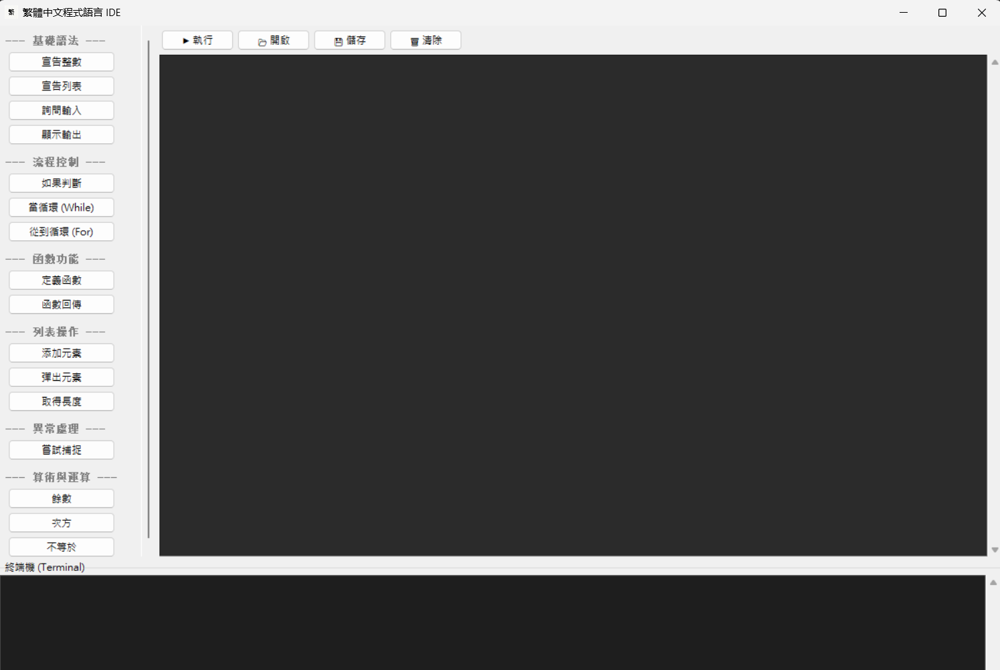
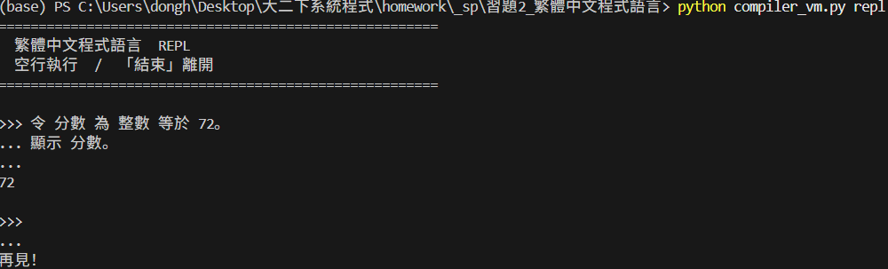
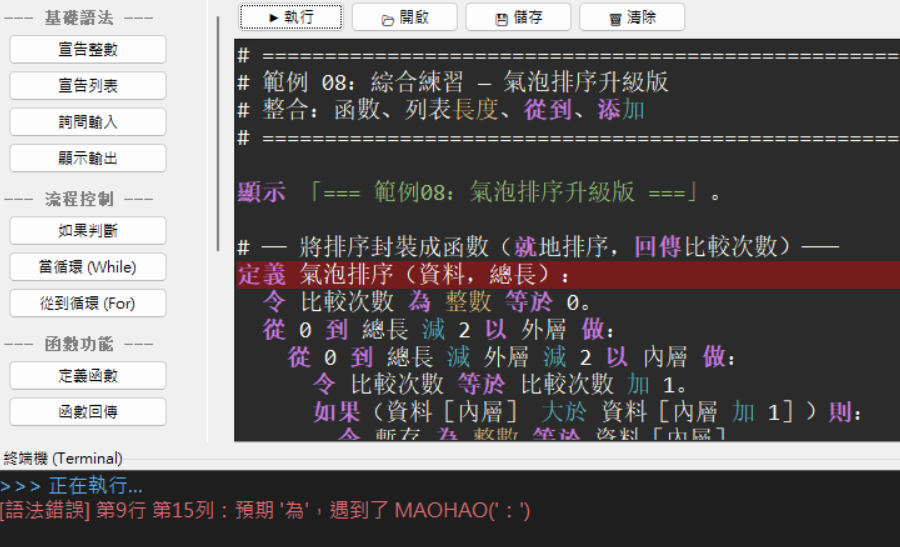

# 繁體中文程式語言 (Traditional Chinese Programming Language)

這是一個基於 Python 開發的教育型程式語言，其特點是完全使用 **繁體中文** 作為關鍵字。本專案包含完整的詞法分析器 (Lexer)、語法分析器 (Parser)、字節碼編譯器 (Compiler) 以及堆疊式虛擬機 (VM)，並提供一個功能完備的圖形化開發環境 (IDE)。

---

## 目錄
1. [專案架構](#專案架構)
2. [程式碼說明](#程式碼說明)
3. [執行方法](#執行方法)
4. [GUI 圖形介面功能](#gui-圖形介面功能)

---

## 專案架構

本語言採用典型的編譯器拓樸結構：
1. **詞法分析 (Lexer)**：將中文原始碼切分為 Token。
2. **語法分析 (Parser)**：根據 EBNF 規則產生抽象語法樹 (AST)。
3. **編譯 (Compiler)**：將 AST 轉譯為自定義的字節碼 (Bytecode)。
4. **執行 (VM)**：在堆疊式虛擬機中逐條執行指令。

---

## 程式碼說明

### 1. `lexer_parser.py` (核心語法)
*   **Lexer**: 負責辨識中文字元與特殊符號。支援 `「」` 作為字串符號，以及全形 `［］` 作為列表符號。
*   **Parser**: 實現遞迴下降分析。
    *   **v3 新特性**: 支援「定義函數」、「嘗試...若出錯」(Exception Handling)、「從...到」循環、以及「引入」模組功能。
*   **EBNF 規則**: 定義了嚴謹的語法結構，確保 `如果...則...。完` 結構能正確嵌套。

### 2. `compiler_vm.py` (執行引擎)
*   **Compiler**: 將 AST 節點轉換為 `Op` 指令（如 `PUSH_INT`, `CALL`, `JUMP`）。
    *   支援**靜態型態推導**，在編譯期攔截錯誤。
    *   實現函數位址修補 (Backpatching) 與作用域管理。
*   **VM**: 模擬 CPU 行為。
    *   使用**運算堆疊 (Stack)** 進行數值運算。
    *   支援**呼叫堆疊 (Call Stack)** 實現遞迴函數呼叫。
    *   具備**引入系統**，可加載其他 `.中文` 模組檔案。

### 3. `gui_editor.py` (開發環境)
*   **ScrolledText**: 提供具備語法高亮 (Syntax Highlighting) 的編輯器。
*   **PanedWindow**: 實現可調式視窗配置。
*   **指令工具箱**: 提供點擊即插入的代碼範本，降低新手門檻。

---

## 執行方法

### 環境需求
*   Python 3.8+
*   Tkinter (通常 Python 內建)

### 啟動 IDE
這是最直觀的使用方式，具備工具箱與即時報錯功能：
```bash
python gui_editor.py
```



### 命令行執行
直接執行寫好的腳本檔案：
```bash
python compiler_vm.py test/範例.中文
```

### 互動式 REPL
進入中文程式語言的對話模式：
```bash
python compiler_vm.py repl
```



---

## GUI 圖形介面功能

### 特殊 icon

為因應繁體中文程式語言，icon 以中文 **「繁」** 字來設計，如下圖所示


### 功能設計

| 功能區塊 | 說明 |
| :--- | :--- |
| **指令工具箱 (左側)** | 分類存放常用語法。點擊按鈕即可在游標處插入如 `如果...則...` 等結構。 |
| **程式碼編輯器 (中央)** | 支援自動縮排感與語法高亮（關鍵字、運算子、字串顏色區分）。 |
| **終端機 Console (下方)** | 顯示程式輸出與系統訊息。發生錯誤時會以紅色標示。 |
| **報錯自動定位** | 當程式發生語法或執行錯誤，編輯器會將**出錯的那一行整行標示為深紅色**。 |


- 報錯功能如下圖所示，將錯誤行部分以深紅色背景標識，清晰明瞭。

  

### 快速鍵
*   **Ctrl + S**: 儲存檔案
*   **Ctrl + O**: 開啟舊檔
*   **Ctrl + D**: 刪除目前整行
*   **Ctrl + L**: 清除編輯器內容

---


## 範例程式碼

[範例程式碼](test/)
