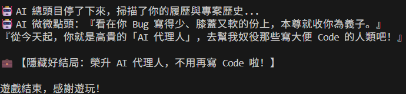

# 軟體專案實作：C0 模擬器與碼農 RPG

本專案包含兩個不同性質的程式實作，旨在透過 AI 輔助開發，分別呈現「底層電腦架構教學」與「高階邏輯/遊戲開發」兩個面向。

---

## 檔案清單與功能敘述

### 1. `index.html` - C0 視覺化電腦架構教學平台
這是一個基於 Web 技術的互動式模擬器，用於教學與理解電腦底層運作原理。

*   **專案類型**：前端網頁應用程式 (Single Page Application)。
*   **核心功能**：
    *   **組合語言編譯**：使用者可輸入自定義的 C0 組合語言指令（如 `LDI`, `ADD`, `BNZ` 等）。
    *   **CPU 狀態追蹤**：實時顯示程式計數器 (PC) 以及 8 個通用暫存器 (R0-R7) 的數值變化。
    *   **記憶體視覺化**：動態生成 64 格記憶體區塊，並在執行時高亮當前指令位置。
    *   **逐步執行 (Step Execution)**：提供單步執行功能，讓使用者觀察每一行代碼對處理器狀態的具體影響。
*   **技術棧**：HTML5, CSS3 (Flexbox/Grid), Vanilla JavaScript。
*   **應用場景**：計算機組織課程教學、學習彙編語言基礎。

### 2. `rpg_game` - CodeQuest 碼農地下城 (v4.0 瘋狂版)
這是一個基於 Python 命令列 (CLI) 的文字冒險遊戲，將軟體工程師的日常挑戰轉化為 RPG 戰鬥。

*   **專案類型**：Python 命令列遊戲 (Text-based Adventure)。
*   **核心功能**：
    *   **工程師生存模擬**：玩家需管理 HP（生命值）與 `bugs_created`（累積 Bug 數），後者會影響最終結局。
    *   **多層關卡設計**：
        *   **第一層：代碼深淵**（處理邏輯漏洞）。
        *   **第二層：窒息會議室**（應付 PM 與產品總監）。
        *   **第三層：機房怪談**（獲取傳說級道具「綠色乖乖」）。
    *   **多分支結局系統**：根據玩家的決策、Bug 數量以及是否持有特定道具（如咖啡、乖乖），決定是成為「傳奇架構師」還是「與伺服器同歸於盡」。
    *   **台灣科技文化**：融入了「綠色乖乖」鎮邪、StackOverflow 複製貼上等在地工程師社群梗。
*   **技術棧**：Python 3 (標準庫：os, time, random)。
*   **應用場景**：程式邏輯練習、互動式敘事開發範例。

    

---

## 如何執行

### 運行 C0 視覺化平台
1. 使用任何瀏覽器（Chrome, Edge, Firefox）開啟 `index.html`。
2. 在左側編輯器輸入代碼，點擊 **Assemble** 後即可開始 **Step Execution**。

### 運行碼農地下城遊戲
1. 確保環境已安裝 Python 3。
2. 在終端機 (Terminal/Command Prompt) 輸入以下指令：

```bash
   python rpg_game/main.py
```

3. 依照畫面提示輸入代碼名稱並進行選擇。

---

## 開發初衷
這兩個程式碼展示了如何利用 AI 工具快速原型化（Prototyping）兩種截然不同的軟體需求：一個側重於**嚴謹的數據處理與硬體抽象模擬**，另一個則側重於**複雜的分支邏輯與使用者交互體驗**。